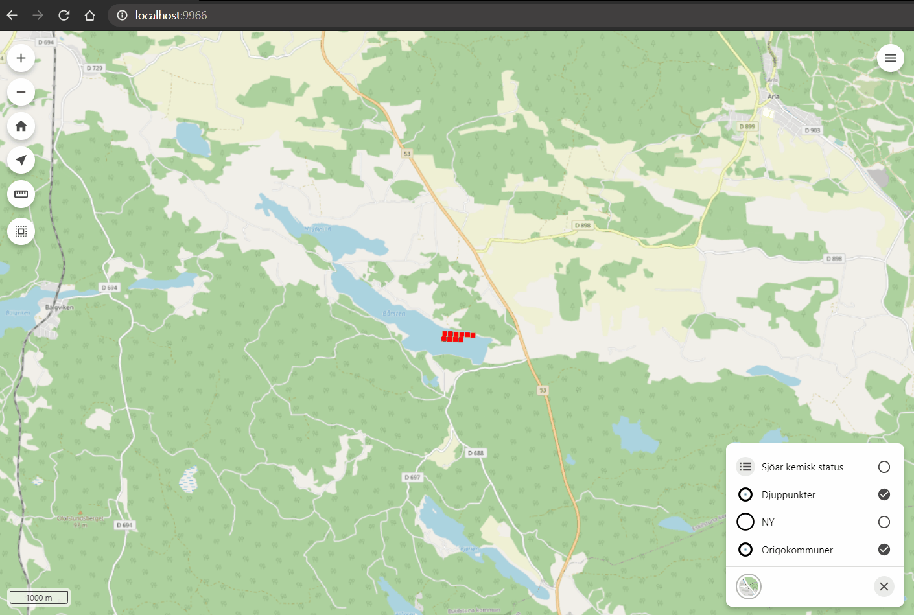

# ek-export-plugin

Knapp som skickar anrop till Eskilstunas .NET projekt för fastighetsrapporter. Kan även anpassas för anrop till andra tjänster.

**Parametrar:**
- layer: Lagernamnet för fastigheter
- hostname: URL till önskad host som kör tjänsten för .NET projektet. Ta inte med backslash i slutet av URL:en.
- attribute: Det attribut för id/fnr som ska skickas med i anropet.
- buttonText: Knappens text.
- modalTitle: Titel på popup-fönster.
- modalContentText: Text som visas i popup-fönster.
- modalButtonText: Knappens text i popup-fönster.
- customEndpoint: För anrop till annan tjänst; den del av adressen som ska läggas till efter host. Börja med frontslash /.
- customParameters: För anrop till annan tjänst; de URL-parametrar som ska inkluderas. Sista parametern bör vara den som tar emot objekt-ID:n och ska avslutas med likhetstecken =.

**Exempel:**
```HTML
<script type="text/javascript">
    var origo = Origo('index.json');
    origo.on('load', function (viewer) {
      var origoexportetuna = Origoexportetuna({
        layer: "sokvyx_djupdata_djuppunkter_vy",
        hostname: "https://kartakarta.karta",
        attribute: "fnr",
        buttonText: "Hämta excel"
      });
      viewer.addComponent(origoexportetuna);
    });
</script>
```

**Exempel med anpassade URL-parametrar:**
```HTML
<script type="text/javascript">
    var origo = Origo('index.json');
    origo.on('load', function (viewer) {
      var origoexportetuna = Origoexportetuna({
        layer: "sokvyx_djupdata_djuppunkter_vy",
        hostname: "https://kartakarta.karta",
        customEndpoint: "/mitt_anpassade_api.aspx",
        customParameters: "layerNameInDb=search_view_x_depth&fnrList=",
        attribute: "fnr",
        buttonText: "Hämta excel"
      });
      viewer.addComponent(origoexportetuna);
    });
</script>
```

### Knappens placering med origo-servers excelcreator


### Knappens placering utan origo-servers excelcreator

